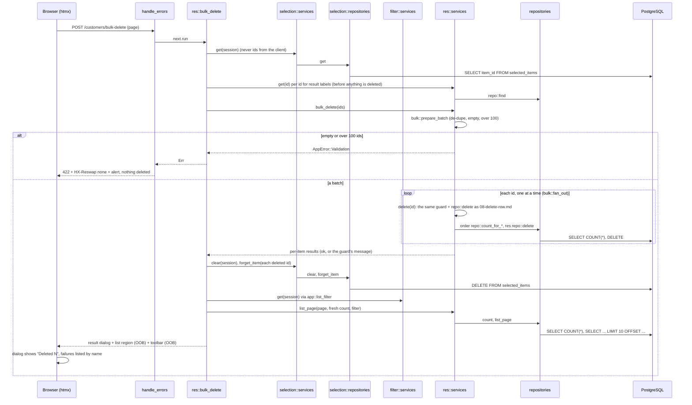

# `POST /<res>/bulk-delete`: delete the selection

```mermaid
sequenceDiagram
    participant B as Browser (htmx)
    participant L as handle_errors
    participant H as res::bulk_delete
    participant SelS as selection::services
    participant SelR as selection::repositories
    participant FS as filter::services
    participant S as res::services
    participant R as repositories
    participant DB as PostgreSQL
    B->>L: POST /customers/bulk-delete (page)
    L->>H: next.run
    H->>SelS: get(session) (never ids from the client)
    SelS->>SelR: get
    SelR->>DB: SELECT item_id FROM selected_items
    H->>S: get(id) per id for result labels (before anything is deleted)
    S->>R: repo::find
    H->>S: bulk_delete(ids)
    S->>S: bulk::prepare_batch (de-dupe, empty, over 100)
    alt empty or over 100 ids
        S-->>H: AppError::Validation
        H-->>L: Err
        L-->>B: 422 + HX-Reswap none + alert, nothing deleted
    else a batch
        loop each id, one at a time (bulk::fan_out)
            S->>S: delete(id): the same guard + repo::delete as 08-delete-row.md
            S->>R: order repo::count_for_*, res repo::delete
            R->>DB: SELECT COUNT(*), DELETE
        end
        S-->>H: per-item results (ok, or the guard's message)
        H->>SelS: clear(session), forget_item(each deleted id)
        SelS->>SelR: clear, forget_item
        SelR->>DB: DELETE FROM selected_items
        H->>FS: get(session) via app::list_filter
        H->>S: list_page(page, fresh count, filter)
        S->>R: count, list_page
        R->>DB: SELECT COUNT(*), SELECT ... LIMIT 10 OFFSET ...
        H-->>B: result dialog + list region (OOB) + toolbar (OOB)
        B->>B: dialog shows "Deleted N", failures listed by name
    end
```

---
[All endpoints](README.md) · [Per-resource differences](README.md#per-resource-differences) · [Errors](13-errors.md)
